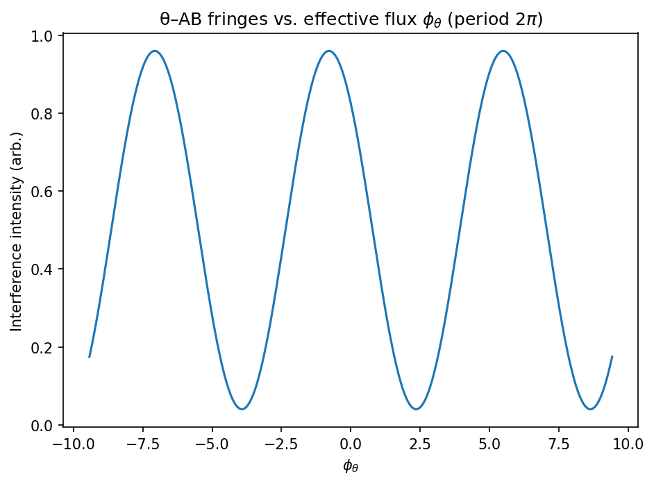

# The X–θ Framework: Geometry, Analogies, Math, and Where It Bites Physics A Unified Non‑Relativistic and Relativistic Formulation on $Q=\mathbb{R}^{3,1}\times S^1$
 
- **Author:** Divyang Panchasara
- **Date:** 14 Sep 2025
- **Status:** Working Draft (v2)

---

## Contents

- [Abstract](#abstract)
- [0. Overview (Steering by Phase: A Quick Tour)](#friendly-picture)
- [1. The X–θ Mathematical Framework (Central Formalism)](#x-theta-framework)
  - [1.1 Configuration space, connection, and curvature](#config-connection-curvature)
  - [1.2 Non‑relativistic Lagrangian, Hamiltonian, and currents](#nr-lagrangian)
  - [1.3 Relativistic worldline, massless limit, and covariant wave equation](#relativistic-worldline)
  - [1.4 Gauge invariance on Q and large loops](#gauge-invariance)
  - [1.5 Consistency checks & known limits](#consistency-checks)
- [2. Phenomena & Tests (Lab and Null‑EM Signatures)](#lab-phenomenology)
  - [2.1 θ–AB phase under null spatial fields](#theta-ab)
  - [2.2 Cross‑Hall drift from mixed curvature](#cross-hall)
  - [2.3 Sidebands from the rotor Hamiltonian](#sidebands)
  - [2.4 Order‑of‑magnitude anchors for I](#iom)
  - [2.5 Falsification protocol (disentangling look‑alikes)](#falsification)
  - [2.6 Consistency checks & limits (QM/NR)](#lab-consistency)
  - [2.7 Methods: θ–Aharonov–Bohm interferometer](#methods-theta-ab)
  - [2.8 Mesoscopic Transport: AB Rings with a θ‑Flux Offset](#mesoscopic)
  - [2.9 Singularity seam: where classical GR fails and QM fixes](#singularity-seam)
- [3. Cosmology Link — From Minisuperspace to a Bounce](#cosmology-link)
  - [3.1 Choice of I: FRW (stiff) vs. WDW (barrier)](#i-of-a)
  - [3.2 Classical bounce (self‑balanced a^{-6} and effective potential)](#classical-bounce)
  - [3.3 Wheeler–DeWitt (quantum) wall at a=0](#wdw)
- [4. Simulation Playbook (Minimal Viable Demos)](#simulation-playbook)
- [5. Reserved — Open for Future Extensions](#reserved-5)
- [6. Unified Force — Fixed‑Core (Stueckelberg) Edition](#unified-force)
- [7. Notation & Symbols (quick lookup)](#notation)
- [8. Related Work & Originality](#related-work)
- [9. Vacuum Energy in X–θ: From Knife‑Edge to Relaxation](#vacuum-energy)
- [Appendix A — Cross‑Hall Drift Coefficient (paraxial beam)](#appendix-a)
- [Appendix B — Glossary](#appendix-b)
- [References](#references)
- [License & Contact](#license-contact)

---

## Abstract

Imagine our universe has an extra hidden dimension shaped like a circle. This idea, part of the X–θ theory, aims to unify our understanding of fundamental forces like electromagnetism and gravity through this additional dimension. In this paper, we explain how this compact dimension affects physical phenomena, such as electromagnetic fields and quantum mechanics. We explore its implications for both laboratory experiments and cosmic phenomena and propose specific experiments to test this theory. These experiments could uncover new insights about the fabric of our universe, making the X–θ theory not only intriguing but also testable in real‑world settings.

Concrete predictions in one line: interferometric phases are $2\pi$‑periodic in the effective $\theta$‑flux and rotor sidebands are spaced by $\Delta E\approx\hbar^2/(2I)$, enabling a direct lab calibration of the phase inertia $I$.

---

## 0. Overview (Steering by Phase: A Quick Tour)

Picture ordinary motion as the wheels of a car and $\theta$ as a small, hidden steering column geared to them. Even on a perfectly flat road (no EM fields), turning the hidden column and coming back to where you started leaves a memory—a loop‑phase (holonomy)—that interferometers can read. If the gear ratio varies across space (the mixed curvature $G_{\mu\theta}$), the car drifts sideways (a cross‑Hall response). The dial is periodic: turn it by $2\pi$ and the effects repeat.

Three lab anchors:
- $\theta$–Aharonov–Bohm (null‑EM holonomy): phase shifts from $\oint A_\theta\,d\theta$ even when $\mathbf E=\mathbf B=0$.
- Cross‑Hall drift: a sideways push set by spatial gradients $\partial_i A_\theta$ (i.e., $G_{\mu\theta}$).
- [Rotor](#glossary-rotor) sidebands: near‑harmonic lines spaced by $\Delta E \approx \hbar^2/(2I)$ that calibrate the phase inertia $I$.

One dial $\to$ many thermometers. In the 4D Stueckelberg completion, the same dial gives the force a single range [${\lambda_\theta}$](#glossary-yukawa-range) that shows up—at different weights—in gravity (Yukawa tweak to Newton), in Coulomb tests (a small bump via kinetic mixing), and in weak‑sector checks. A single range ties many meters together.

Three anchors for the rest of the paper:
- Holonomy: a loop in $\theta$ leaves a phase. That phase is what interferometers read out.
- Periodicity: effects repeat every $2\pi$ in the effective flux $\phi_\theta$.
- Patches: potentials live on patches, but only $G=dA$ and loop integrals like $\oint A_\theta d\theta$ are physical.

---

### Intuitive Overview: Drone Navigation System

Think of steering not by pushing on the wheels but by setting a destination. The drone’s navigation system is the compact angle $\theta$: you dial a waypoint, and the autopilot handles the path. Even over a calm field (no spatial EM), closing a loop in the dial leaves a tell‑tale phase the camera can see (the $\theta$–AB effect in §2.1). If terrain subtly changes across the field (a gradient in $A_\theta$, i.e., nonzero $G_{\mu\theta}$), the autopilot nudges the drone sideways—a cross‑Hall drift.

- Navigation computer ≙ compact dimension ($\theta$). You set $\theta$; dynamics follow. The loop memory is the holonomy $\displaystyle \phi_\theta=\tfrac{q_\theta}{\hbar}\oint A_\theta d\theta$.
- Indirect control. You don’t pull on forces directly; you steer phase. That’s why signals persist at $\mathbf E=\mathbf B=0$.
- One dial → many ranges. In the unified‑force picture (§6), the same dial sets a single [Yukawa range](#glossary-yukawa-range) $\lambda_\theta=1/m_\theta$ that leaves correlated, short‑range fingerprints in gravity and [QED](#glossary-qed).
- Handling “no‑fly zones” (singularities). Near dangerous spots, the autopilot changes trajectories so you never hit “infinite curvature.” In FRW, the fiber’s effective $+\,C/a^2$ core creates a classical turning point (§3.2) and a Wheeler–DeWitt quantum wall that keeps evolution unitary (§3.3).

Pointers: lab holonomy (§2.1), sidebands as an inertia gauge (§2.3–§2.4), unified range (§6), bounce and WDW barrier (§3.2–§3.3), and glossary entries for [compact dimension](#glossary-compact-dimension) and [gauge connection](#glossary-gauge-connection).

---

Figure 0.A — Drone navigation analogy (θ steers by phase)

Caption. The drone depicts base motion; the orange dial is the compact $\theta$ fiber. Closing a loop on the dial leaves a holonomy $\phi_\theta$ visible at $\mathbf E=\mathbf B=0$; blue arrows illustrate transverse, cross‑Hall drifts when $\partial_\mu A_\theta\neq 0$ (i.e., $G_{\mu\theta}\neq 0$).

---

## 1. The X–θ Mathematical Framework (Central Formalism)

We collect the full formalism here; later sections specialize to experiments and cosmology. To match prior drafts that used $F_{ab}$, we write the field‑strength on $Q$ as $G_{ab}\equiv\partial_aA_b-\partial_bA_a$ (synonymous with $F_{ab}$ in earlier text).

<strong>Units and Conventions.</strong> Unless stated otherwise, we use SI units in this section and keep $\hbar$ explicit in quantum‑mechanical contexts. In the relativistic Stueckelberg completion (§6) we adopt natural units with $\hbar=c=1$ for notational clarity; when needed, factors of $\hbar$ and $c$ can be restored by dimensional analysis.

### 1.1 Configuration space, connection, and curvature

$$
Q=\mathbb{R}^{3,1}\times S^1,\qquad q^a=(X^\mu,\theta),\qquad a\in\{0,1,2,3,\theta\}.
$$

$$
A=A_a\,dq^a= A_\mu\,dX^\mu + A_\theta\,d\theta,\qquad G=dA,\qquad G_{ab}=\partial_aA_b-\partial_bA_a.
$$

Key mixed component: $G_{\mu\theta}=\partial_\mu A_\theta-\partial_\theta A_\mu$.

<strong>configuration space & curvature</strong>

- $Q=\mathbb R^{3,1}\times S^1$ just means we add one extra circular coordinate $\theta$ (an angle with period $2\pi$; a [compact dimension](#glossary-compact-dimension)) to ordinary space–time. A point is $(X^\mu,\theta)$.
  
  _Analogy — Compact dimension:_ From far away a garden hose looks like a 1‑D line, but up close you see its circular cross‑section. That unseen small circle is like the compact $S^1$; it’s invisible at large scales but matters up close.
- A “[gauge connection](#glossary-gauge-connection)” $A$ is a geometric bookkeeping tool for how phases change when you move. Mathematically, it is a 1‑form $A=A_a\,dq^a$; in components here: $A=A_\mu\,dX^\mu + A_\theta\,d\theta$.
  
  _Analogy — Gauge connection:_ Navigating a boat on a river with shifting currents, your navigation tool tells you how to steer to reach the same destination. The connection $A$ plays that role—adjusting phases so transport stays consistent.
- The curvature (field strength) is the exterior derivative $G=dA$ with components $G_{ab}=\partial_a A_b-\partial_b A_a$. It measures the failure of phase changes to cancel on a closed loop (nonzero holonomy).
  
  _Analogy — Holonomy:_ Hike a loop around a hill and your compass heading can change after returning to the start. That net twist is like holonomy—a loop‑induced phase shift.
- The mixed curvature $G_{\mu\theta}$ couples ordinary motion and internal rotation; in the common gauge $\partial_\theta A_\mu=0$ this reduces to a spatial gradient $\partial_\mu A_\theta$ that produces the cross‑Hall effect discussed later.
  
  _Analogy — Mixed curvature:_ Two meshed gears: turning one (spatial motion) makes the other rotate (compact angle). Their coupling is $G_{\mu\theta}$—motion in one direction drives the other.
 - Symbols: $q_\theta$ (internal charge on the fiber), $A_\theta$ (internal gauge potential along $S^1$).

### 1.2 Non‑relativistic Lagrangian, Hamiltonian, and currents

At a glance: ordinary Schrödinger dynamics on space couples minimally to $A_\mu$, and the internal [rotor](#glossary-rotor) couples to $A_\theta$ with inertia $I$, producing AB‑like phases and sidebands.

With Newtonian time $t$ and $\phi\equiv A_0$,

$$
L_{\mathrm{NR}}=\frac{m}{2}\dot X^2+\frac{I}{2}\dot\theta^2+q_X\,A_i\dot X^i+q_\theta\,A_\theta\dot\theta - q_X\,\phi.
$$

Canonical momenta and equations of motion:

$$
P_i=m\dot X^i+q_X A_i,\qquad p_\theta=I\dot\theta+q_\theta A_\theta,
$$

$$
\boxed{\ m\ddot X_i = q_X\big(E_i + (\dot{\mathbf X}\times\mathbf B)_i\big) + q_\theta\,G_{i\theta}\,\dot\theta\ },\qquad 
\boxed{\ I\ddot\theta = q_\theta\,G_{\theta 0}+ q_\theta\,G_{\theta i}\,\dot X^i\ },
$$

with $E_i=-\partial_tA_i-\partial_i\phi$ and $\mathbf B=\nabla\times\mathbf A$. In the common gauge $\partial_\theta A_i=0$ one has $G_{i\theta}=\partial_iA_\theta$.

Quantum dynamics on $Q$:

$$
 i\hbar\,\partial_t\psi = \left[\frac{1}{2m}(-i\hbar\nabla_X-q_X\mathbf A)^2 + \frac{1}{2I}(-i\hbar\partial_\theta-q_\theta A_\theta)^2 + q_X\,\phi\right]\psi.
$$

Continuity on $Q$:

$$
 \partial_t\rho + \nabla_X\!\cdot\mathbf J_X + \partial_\theta J_\theta=0,
$$

$$
 \mathbf J_X=\frac{1}{m}\,\mathrm{Re}[\psi^\dagger(-i\hbar\nabla_X-q_X\mathbf A)\psi],\qquad J_\theta=\frac{1}{I}\,\mathrm{Re}[\psi^\dagger(-i\hbar\partial_\theta-q_\theta A_\theta)\psi].
$$

<strong>Units sanity (quick check)</strong>

- $[A_\theta] = \hbar/q_\theta$ so that $q_\theta A_\theta$ carries momentum units along $\theta$; $[\partial_i A_\theta] = (\hbar/q_\theta)/\text{length}$.
- The Lagrangian terms $q_\theta A_\theta\,\dot\theta$ (energy) and the cross–Hall force piece $q_\theta (\partial_i A_\theta)\,\dot\theta$ (force) therefore have the right dimensions.

<strong>Reading the Hamiltonian (at a glance)</strong>

- The substitutions $\mathbf p\to \mathbf p - q_X\mathbf A$ and $p_\theta\to p_\theta - q_\theta A_\theta$ are the minimal‑coupling rule that incorporate forces via potentials.
- The two kinetic energies, $\tfrac{1}{2m}(\cdots)^2$ and $\tfrac{1}{2I}(\cdots)^2$, describe spatial motion and internal rotation, respectively. The parameter $I$ is an “internal moment of inertia”.
- The continuity equation $\partial_t\rho + \nabla\!\cdot\mathbf J_X + \partial_\theta J_\theta=0$ is just probability conservation on the bigger space $Q$.

<strong>EP hygiene (assumption, used throughout).</strong> To avoid composition‑dependent violations of the equivalence principle at leading order, we take the $\theta$‑charge to be composition‑independent, e.g., $Q_\theta=\beta\,m$ (proportional to inertial mass) or proportional to $B\!-
L$. This choice makes the new force universal to first approximation and is consistent with torsion‑balance (Eötvös‑type) constraints. Any residual composition dependence then only arises via the tiny portal mixings used in §6 and sits below current leading bounds.
- Expanding the wavefunction in Fourier modes $e^{i\ell\theta}$ makes the internal motion look like a rotor with levels spaced by $\sim\hbar^2/I$ (the sidebands).
- Noether (θ‑shift): global $\theta\to\theta+\text{const}$ implies conservation of $p_\theta=I\dot\theta+q_\theta A_\theta$. In homogeneous FRW, the conserved quantity is the comoving momentum
  $$
  \Pi_\theta \equiv a^3\,p_\theta = a^3\big(I_0\,\dot\theta + q_\theta A_\theta\big)=\text{const}.
  $$
  For $A_\theta=0$ this reduces to $a^3 I_0\,\dot\theta=\text{const}$.
Analogy: think of $\theta$ as a tiny flywheel; $I$ is its moment of inertia and $A_\theta$ is a gentle hand that can shift its phase.
Rotor spectrum and holonomy shift:

$$
 E_\ell=\frac{\hbar^2}{2I}\Big(\ell-\frac{\phi_\theta}{2\pi}\Big)^2,\qquad \phi_\theta\equiv\frac{q_\theta}{\hbar}\oint A_\theta\,d\theta,\qquad \ell\in\mathbb Z.
$$

Derivation (one‑liner). From invariance under $\theta\to\theta+\epsilon$, Noether gives $p_\theta=\partial L/\partial\dot\theta=I\dot\theta+q_\theta A_\theta$; in FRW with $I(a)=I_0$ the comoving momentum $\Pi_\theta\equiv a^3 p_\theta$ is conserved, yielding $\rho_\theta=\Pi_\theta^2/(2 I_0 a^6)$ used in §3.

### 1.3 Relativistic worldline, massless limit, and covariant wave equation

Worldline action with [einbein](#glossary-einbein) $e(\tau)$ and extended metric $G_{ab}^{\mathrm{(geom)}}dq^adq^b=\eta_{\mu\nu}dX^\mu dX^\nu+\kappa^2 d\theta^2$:

 $$
 \boxed{\ S_{\mathrm{rel}}=\int d\tau\Big[\frac{1}{2e}\,G^{\mathrm{(geom)}}_{ab}\,\dot q^a\dot q^b - \frac{e}{2}\,m^2 + q_X\,A_\mu\,\dot X^\mu + q_\theta\,A_\theta\,\dot\theta\Big]\ },
Canonical momenta (to make constraints explicit):
$$
 P_a\equiv \frac{\partial L}{\partial \dot q^a}\,,\qquad \text{so the gauge‑covariant combination is }\ (P_a - q_a A_a).
$$
The mass‑shell constraint then reads $G^{ab}_{\mathrm{(geom)}}(P_a - q_a A_a)(P_b - q_b A_b) + m^2 = 0$.
$$

 with the mass‑shell constraint $G^{ab}_{\mathrm{(geom)}}(P_a-q_aA_a)(P_b-q_bA_b)+m^2=0$ and $q_a=(q_X, q_\theta)$ acting on their respective components.

<strong>Worldline and einbein (at a glance)</strong>

- The particle’s path is parametrized by $\tau$ (any convenient parameter). The function $e(\tau)$, called an einbein, keeps the action reparametrization‑invariant (physics doesn’t care how you label points along the path).
- Varying $e$ enforces the “mass‑shell” condition (a Pythagorean relation between momenta) that reduces to $E^2=\mathbf p^2+m^2$ when fields vanish.
- The added metric piece $\kappa^2 d\theta^2$ says motion in $\theta$ also contributes to the worldline length; in the non‑relativistic limit one finds $I=m\kappa^2$.
- In the massless limit, the constraint $\eta_{\mu\nu}\dot X^\mu\dot X^\nu+\kappa_0^2\dot\theta^2=0$ means the motion is “null” (lightlike) in the enlarged geometry.
Intuition: the einbein $e(\tau)$ is like a choice of speedometer; it sets the clock along the path without changing the trip.

Massless limit ($m\to 0$) with finite $\kappa_0$:

$$
 S_{m=0}=\int d\tau\Big[\frac{1}{2e}(\eta_{\mu\nu}\dot X^\mu\dot X^\nu+\kappa_0^2\dot\theta^2)+q_X\,A_\mu\dot X^\mu+q_\theta\,A_\theta\dot\theta\Big],\qquad \eta_{\mu\nu}\dot X^\mu\dot X^\nu+\kappa_0^2\dot\theta^2=0.
$$

Covariant wave equation on $Q$ (scalar):

$$
 \big[D_\mu D^\mu + \kappa^{-2} D_\theta^2 + m^2\big]\,\Psi(X,\theta)=0,\quad D_\mu\equiv\partial_\mu+\tfrac{i}{\hbar}q_XA_\mu,\; D_\theta\equiv\partial_\theta+\tfrac{i}{\hbar}q_\theta A_\theta.
$$

**NR map.** Removing the rest‑energy phase yields the Schrödinger equation in §1.2 provided we identify (notation match: $q_\theta\equiv g_\theta Q_\theta$)

$$
\boxed{\ I = m\,\kappa^2\ }.
$$

<em>Parameter map — probe inertia vs. mediator mass.</em> The rotor inertia $I$ is a property of the <em>probe</em> degree of freedom and, in the relativistic worldline picture, ties to the geometry scale via $I=m\kappa^2$. By contrast, the 4D vector mass $m_\theta$ in the Stueckelberg completion (see §6) is a property of the <em>mediator</em>, set by $m_\theta=g_\theta f_\theta$ and controlling the shared Yukawa range $\lambda_\theta=1/m_\theta$. In general phenomenology these are independent dials (probe inertia vs. mediator range). Counting parameters: $(I, q_\theta)$ govern rotor kinematics and holonomy in §2; $(g_\theta, f_\theta, \varepsilon)$ (and charge assignment $Q_\theta$) control force range and portal strengths in §6.

### 1.4 Gauge invariance on $Q$ and large loops

 Gauge transformations act as $A_\mu\to A_\mu+\partial_\mu\Lambda_X$, $A_\theta\to A_\theta+\partial_\theta\Lambda_\theta$, with $\psi\to \exp\!\left[-\tfrac{i}{\hbar}(q_X\Lambda_X+q_\theta\Lambda_\theta)\right]\psi$. Under a large gauge transformation around the circle, the holonomy shifts as $\displaystyle \oint A_\theta\,d\theta \to \oint A_\theta\,d\theta + 2\pi\,\hbar/q_\theta$ (large‑gauge period $2\pi\hbar/q_\theta$), so only $\phi_\theta = (q_\theta/\hbar) \oint A_\theta d\theta$ modulo $2\pi$ is physical. The Bianchi identity $dG=0$ holds for $G=dA$ when one treats $(A_\mu, A_\theta)$ as components of a single connection; in experiments we often choose $\partial_\theta A_\mu=0$, leaving the measurable gradient $\partial_\mu A_\theta$.

Holonomy schematic (support)

Caption. Stokes‑type rectangles visualize how loop integrals of the connection relate to enclosed curvature; only the loop integral modulo the large‑gauge period is observable.

### 1.5 Consistency checks & known limits

Objective. Explain why internal consistency checks matter and how they validate the X–$\theta$ framework by showing it reduces to established physics in the appropriate limits.

Explanation.

- Turning off the fiber ($I\to\infty$ and $q_\theta\to 0$). Removing the fiber’s inertia and coupling decouples the compact dimension. The dynamics reduce to standard electrodynamics and quantum mechanics on $\mathbb R^{3,1}$: no $A_\theta$ phases and no rotor sidebands.
- Turning off base electromagnetism ($q_X\to 0$). With spatial EM switched off, the system is a free internal rotor that can still depend on $X$ through $A_\theta(X)$. Sidebands with spacing $\Delta E\approx \hbar^2/(2I)$ and the $\theta$–AB phase $\Delta\varphi_\theta=\tfrac{q_\theta}{\hbar}\oint A_\theta d\theta$ persist. These are intrinsic to the compact fiber.
- Relativistic $\to$ non‑relativistic. Identifying $I=m\kappa^2$ ensures that, after removing the rest‑energy phase, the Schrödinger equation inherits the correct coefficients for the rotor term $\tfrac{1}{2I}(-i\hbar\partial_\theta-q_\theta A_\theta)^2$.

Why these checks matter (at a glance)

- Sanity with known physics. New structure must decouple cleanly: $I\to\infty$, $q_\theta\to 0$ $\Rightarrow$ ordinary EM/QM/relativity.
- Isolating the fiber. $q_X\to 0$ tests fiber‑only signatures (sidebands and $\theta$–AB) at $\mathbf E=\mathbf B=0$.
- Continuity of limits. $I=m\kappa^2$ ties geometry to inertia so the relativistic and NR descriptions match term‑by‑term.

What this validates

- Compatibility: aligns with well‑tested theories where new effects should vanish.
- Credibility: parameter limits map smoothly to known behaviors (no surprises where there shouldn’t be any).
- Scope: delineates where new predictions apply (nonzero $q_\theta$, finite $I$, nontrivial $A_\theta(X)$ or $G_{\mu\theta}$).

---

### 1.6 Worked reductions (one screen)

Why they matter (one‑liners):

- Fiber off ($I\to\infty,\ q_\theta\to 0$) → reduces to standard EM/QM/relativity; any residual signal would be unphysical here.
- Base EM off ($q_X\to 0$) → $\theta$‑sidebands and $\theta$‑AB survive, proving they’re intrinsic to the fiber (not stray EM).
- Relativistic → NR via $I=m\kappa^2$ → enforces coefficient‑matching after removing rest energy.

Reductions:

1) $I\to\infty,\ q_\theta\to 0$. The rotor term $\tfrac{1}{2I}(-i\hbar\partial_\theta - q_\theta A_\theta)^2 \to 0$, so the wave equation on $Q$ collapses to the usual covariant wave equation on $\mathbb R^{3,1}$.

2) $q_X\to 0$. The base covariant piece vanishes while the $\theta$–AB phase $\Delta\varphi_\theta=\tfrac{q_\theta}{\hbar}\oint A_\theta\,d\theta$ remains, so neutral carriers still show [rotor](#glossary-rotor) sidebands ($\Delta E\approx\hbar^2/(2I)$) and $\theta$–AB at $\mathbf E=\mathbf B=0$.

3) $I=m\kappa^2$. Removing the rest‑energy phase maps the relativistic equation to the Schrödinger form with the correct rotor coefficient $\tfrac{1}{2I}$.  
$$\boxed{\ I=m\kappa^2\ }$$

Limits & Outcomes (at a glance)

| Limit | Outcome | Observable | Implication |
| --- | --- | --- | --- |
| $I\to\infty,\ q_\theta\to 0$ | Standard EM/QM/relativity (fiber decouples) | AB fringe at $\Phi=0$ (absent); no sidebands | Confirms reduction to known physics when the compact fiber is switched off. |
| $q_X\to 0$ | Fiber‑only response persists | AB fringe at $\Phi=0$ (present); $\Delta E\approx \hbar^2/(2I)$ | Demonstrates intrinsic, fiber‑driven phenomena independent of spatial EM. |
| $I=m\kappa^2$ (NR limit) | Coefficient matching in Schrödinger Hamiltonian | Cross‑check vs §1.2 coefficients | Ensures smooth relativistic→NR continuity via $I=m\kappa^2$. |

## 2. Phenomena & Tests (Lab and Null‑EM Signatures)

Convention used in §2. “Fiber‑off” means $I\to\infty$ and $q_\theta\to 0$, i.e., the compact fiber decouples and responses reduce to ordinary QM/EM.

### 2.1 $\theta$–AB phase under null spatial fields

At a glance: a closed loop in the internal angle leaves a measurable phase even when $\mathbf E = \mathbf B = 0$.

From $L_{\mathrm{NR}}$, the action contribution from the fiber coupling along a closed internal loop $\mathcal C_\theta$ is

$$
 S_\theta= q_\theta\int_{\mathcal C_\theta}\! A_\theta\,d\theta \;\Rightarrow\; \text{path‑integral phase }\; e^{\tfrac{i}{\hbar}S_\theta}=\exp\!\Big[\,i\,\frac{q_\theta}{\hbar}\oint A_\theta\,d\theta\,\Big].
$$

Define the effective $\theta$–flux

$$
 \phi_\theta \equiv \frac{q_\theta}{\hbar}\oint A_\theta\,d\theta.
_Analogy — Holonomy (experiment view):_ Like walking a loop around a hill and finding your compass has rotated, the loop in the $\theta$ direction leaves a net phase twist $\phi_\theta$ even when $\mathbf E=\mathbf B=0$.
$$

Therefore the interference phase shift is

$$
 \boxed{\,\Delta\varphi_\theta \equiv \phi_\theta \pmod{2\pi}\,},\qquad \mathbf E=\mathbf B=0\ \text{along both arms}.
$$

Because only $e^{i\Delta\varphi_\theta}$ is observable, sweeping $\phi_\theta$ by $2\pi$ returns the fringes.

Intuition: this is a **holonomy**. Dial $A_\theta$ and watch fringes move.

<em>Canonical statement — θ–Aharonov–Bohm (reference for other sections).</em> A closed loop in the compact angle produces a measurable, $2\pi$‑periodic phase shift at null spatial EM,
\(\displaystyle \Delta\varphi_\theta=(q_\theta/\hbar)\oint A_\theta\,d\theta\pmod{2\pi}\). This is the canonical θ–AB relation we cross‑reference elsewhere to avoid duplication.

<em>Worked micro‑example (constant $A_\theta$).</em> Suppose along each interferometer arm the internal angle advances by the same $\Delta\theta=2\pi$ (a full loop) and $A_\theta$ is constant. Then
$$\Delta\varphi_\theta=\frac{q_\theta}{\hbar}\oint A_\theta\,d\theta.$$
If $A_\theta$ is tuned so that $\frac{q_\theta}{\hbar}A_\theta=1$, the phase shift is exactly $2\pi$ and the interference pattern returns to its baseline—illustrating the $2\pi$ periodicity in the effective flux $\phi_\theta=\tfrac{q_\theta}{\hbar}\oint A_\theta\,d\theta$.

Experimental setup (concise):
- Mach–Zehnder or double‑slit with two arms arranged so that spatial EM is nulled along both paths (magnetic shielding; DC and AC pickup monitored) while an internal gate drives $\theta(t)$ around a closed loop. Implement the gate as a phase actuator (DDS/AWG) that advances $\theta$ by $2\pi n$ during the arm transit. The $A_\theta$ bias is provided by a calibrated control line to set $\phi_\theta$.
- Synchronize the gate to the packet arrival so both arms experience identical $\theta$ trajectories; verify null spatial fields by inserting/removing a Faraday shield or by flipping conventional AB control (should do nothing here).

Observables & controls:
- Fringe shift vs. effective flux $\phi_\theta$ with explicit $2\pi$ returns. Sweep $\phi_\theta$ slowly and record periodicity; demonstrate invariance under swapping conventional AB solenoid on/off.
- Gate reversals ($\theta\!:\;0\to2\pi$ vs. $2\pi\to0$) leave the holonomy unchanged; imperfect synchronization broadens fringes but does not change period.
- Systematics: residual spatial EM drift (control by flipping magnetic shields), path‑length mismatch (scan delay), amplitude‑to‑phase leakage in the gate (characterize with gate‑off runs).

Figure 2.1a — $\theta$–AB conceptual schematic (cartoon)

Caption (intuition). A two‑arm interferometer with a compact‑fiber gate: a closed loop in $\theta$ imprints a holonomy phase $\Delta\varphi_\theta = (q_\theta/\hbar)\oint A_\theta d\theta$ even when $\mathbf E=\mathbf B=0$ along both arms. The effective flux $\phi_\theta$ is $2\pi$‑periodic.

#### Detailed experimental description — θ–Aharonov–Bohm

- Equipment
  - Two‑path interferometer: atom (Mach–Zehnder/Bragg), neutron/electron biprism, or integrated‑photonics MZI.
  - θ‑drive and bias: programmable “θ gate” to advance the internal phase during transit, plus a DC/slow‑scan bias that sets the effective $A_\theta$ offset.
  - Null‑EM environment: µ‑metal magnetic shielding, Faraday cage, calibrated magnetometer and E‑field probe for logging.
  - Readout and DAQ: fringe sensor (camera/photodiodes/fluorescence), AWG/DDS for θ‑drive, lock‑in (optional), stable timebase, environmental monitors.

- Setup
  1) Balance the interferometer (gate‑off) for high visibility; record baseline phase/contrast.
  2) Verify $\mathbf E\approx\mathbf B\approx 0$ along both arms by inserting/removing shields; require no correlated phase change; log probes.
  3) Program a synchronized $\theta(t)$ so the internal angle advances by $2\pi N_\theta$ during the arm transit; ensure identical timing on both arms.

- Procedure
  1) Differential loop count: drive only one arm or impose a controlled difference $\Delta N_\theta$ between arms; measure phase vs $\Delta N_\theta$.
  2) Bias sweep: ramp the effective $A_\theta$ offset slowly; optionally dither $A_\theta$ for lock‑in extraction.
  3) Large‑gauge return: increment $N_\theta\to N_\theta+1$ at fixed bias and show the fringes return after a net $2\pi$ advance.

- Expected outcomes
  - Fringe shift $\Delta\varphi_\theta = \tfrac{q_\theta}{\hbar}\oint A_\theta d\theta$ that is periodic under $\phi_\theta\mapsto\phi_\theta+2\pi$ and persists at $\Phi=0$ (spatial EM).
  - Slope $d\Delta\varphi_\theta/dA_\theta$ measures $q_\theta/\hbar$ (given $\Delta N_\theta$); combine with rotor sidebands (\S2.3) to calibrate $I$.

- Systematics and mitigation
  - Residual spatial EM: alternate shields and regress out correlated probe signals.
  - Path/temporal mismatch: scan delay; use arm swaps/common‑mode rejection; enforce identical gate timing.
  - Actuator leakage (amplitude→phase): characterize with gate‑off and with a known conventional phase injection; subtract/bound.
  - Cross‑talk: test locality by moving the actuator; include blocked‑arm controls.

- Calibration and analysis
  - Fit fringe phase vs $(A_\theta,\,\Delta N_\theta)$; demonstrate $2\pi$ periodicity and returns under integer loop additions.
  - Null check: vary spatial EM at fixed $(A_\theta,\Delta N_\theta)$ and confirm a response at $\Phi=0$.

Figure 2.1b — θ–AB fringe vs effective flux (simulation)

Data: ../paper/data/exp1_fringe_vs_phi.csv  |  Alt SVG: ../paper/figs/exp1_theta_ab_fringe.svg (data: ../paper/data/exp1_theta_ab_fringe.csv)

Extended visuals (support):

Figure 2.1c — AB‑baseline configuration (null spatial EM)

Figure 2.1d — Vector‑field paths and holonomy intuition

### 2.2 Cross‑Hall drift from mixed curvature

Euler–Lagrange for $X_i$ with $\mathbf E=\mathbf B=0$ gives

$$
 m\ddot X_i = q_\theta\,G_{i\theta}\,\dot\theta\quad (G_{i\theta}=\partial_iA_\theta-\partial_\theta A_i).
$$

For a uniform gate of duration $T$ with nearly constant $\dot\theta$, the centroid shift is

$$
 \boxed{\ \Delta X_i \simeq \alpha\,\frac{q_\theta}{m}\,(\partial_iA_\theta)\,\frac{T^2}{2}\,\dot\theta\ },\qquad \alpha\lesssim 1\ \text{(envelope‑dependent)}.
$$

Intuition: cross‑Hall drift comes from the gradient $\partial_i A_\theta$.

Experimental setup (concise):
- Send narrow wavepackets through a field region with a controlled, static spatial gradient in $A_\theta(X)$ (e.g., two bias electrodes or coils configured to produce $\partial_i A_\theta\neq0$ while keeping $\mathbf E=\mathbf B\approx0$). Drive $\theta(t)$ with a top‑hat or Gaussian gate over duration $T$ during transit.
- Use imaging (centroid tracking) at the output plane to measure transverse displacement $\Delta X_i$. Reverse the sign of $\partial_i A_\theta$ by swapping leads to check odd response.

Observables & controls:
- $\Delta X_i\propto (\partial_i A_\theta)\,T^2\,\dot\theta$ with envelope factor $\alpha$; verify $T^2$ scaling by stretching the gate and odd‑in‑gradient behavior by flipping $\partial_i A_\theta$.
- Zero‑tests: set $\dot\theta\to0$ (no gate) and/or null the gradient to suppress the effect to noise; insert conventional EM fields as a diagnostic—the drift here should be insensitive to them by design.
- Systematics: residual Lorentz forces (monitor with magnetometer, E‑field probe), beam pointing drifts (interleave reference shots), coupling between amplitude and $A_\theta$ bias (calibrate by dithering bias and demodulating at the dither tone).

#### Detailed experimental description — Cross‑Hall drift

- Equipment
  - Narrow, well‑collimated beamline: cold‑atom guide or paraxial photon beam with position‑sensitive detector (camera/PSD).
  - θ‑gradient region: hardware producing an approximately uniform $\partial_y A_\theta$ across the beam (electrode/coil pair or patterned actuator).
  - θ‑drive source: waveform generator for gate $\dot\theta(t)$ during transit; independent DC bias for $A_\theta$.
  - Metrology: beam profiler; velocity or time‑of‑flight to estimate interaction time $T=L/v$; field probes; vibration/temperature monitors; lock‑in (optional).

- Setup
  1) Align the beam through the gradient region; measure linearity and magnitude of $\partial_y A_\theta$ over the beam waist.
  2) Determine transit time $T$ and gate such that $\dot\theta$ is nonzero only within the gradient region.
  3) Implement reversal capability for both signs of $\partial_y A_\theta$ and $\dot\theta$.

- Procedure
  1) Acquire baseline with gate off and gradient nulled; fit/remove static pointing offsets.
  2) Turn on $\dot\theta$; measure centroid shift $\Delta y$ vs. $\partial_y A_\theta$ for both signs; interleave reversals to suppress drifts.
  3) Scaling tests: vary $T$ (via $v$ or $L$) and gate amplitude; confirm $\Delta y \propto T^2\,\dot\theta\,\partial_y A_\theta$ (Appendix A).
  4) Optional lock‑in: dither the gradient or gate at $f_\mathrm{ref}$ and demodulate the centroid at $f_\mathrm{ref}$.

- Expected outcomes
  - Transverse drift odd under $\partial_y A_\theta\to-\partial_y A_\theta$ or $\dot\theta\to-\dot\theta$, vanishing when gradient is nulled or gate is off.
  - Quantitative $T^2$ scaling and linearity in small $\partial_y A_\theta$; insensitivity to added conventional EM fields by design.

- Systematics and mitigation
  - Residual Lorentz forces: monitor fields and regress correlated components; verify insensitivity with known EM field injections.
  - Beam pointing/vibration: interleave reversal sequences; use detector fiducials; average many short shots.
  - Refractive‑index gradients (photons) or gravitational sag (atoms): map with gate off; subtract; keep backgrounds small and symmetric.
  - Amplitude‑bias coupling: dither the DC $A_\theta$ bias and bound leakage at the dither tone.

- Calibration and analysis
  - Fit $\Delta y(\partial_y A_\theta,\dot\theta,T)$ to the Appendix A model to extract the cross‑Hall coefficient and compare with $(I, q_\theta)$ predictions.
  - Report double‑reversal metric (half‑difference between opposite signs) to reject even drifts.

Figure 2.2a — Cross‑Hall drift: centroid trajectory ⟨y(t)⟩ (simulation)

Figure 2.2b — Cross‑Hall scaling: Δy vs T² (simulation)

Data: ../paper/data/exp2_drift_T2.csv

Figure 2.2c — Cross‑Hall schematic (cartoon)

Caption (intuition). A spatial gradient in $A_\theta$ ($G_{i\theta}=\partial_i A_\theta$ in the common gauge) coupled to a gate $\dot\theta\neq 0$ produces a sideways drift of the packet centroid.

### 2.3 Sidebands from the [rotor](#glossary-rotor) Hamiltonian

At a glance: the internal [rotor](#glossary-rotor) quantizes energy into near‑harmonic sidebands with spacing set by $\hbar^2/(2I)$.

Separate variables $\Psi(X,\theta)=\sum_{\ell\in\mathbb Z}\psi_\ell(X)\,e^{i\ell\theta}$. Acting with $\hat H_\theta=\tfrac{1}{2I}(-i\hbar\partial_\theta-q_\theta A_\theta)^2$ yields

$$
 E_\ell(X)=E_0(X)+\frac{\hbar^2}{2I}\Big(\ell-\frac{\phi_\theta}{2\pi}\Big)^2,\qquad \Delta E_\theta\approx\frac{\hbar^2}{2I}\ \text{(nearest–neighbor near }\ell\approx0\text{)}.
$$

Intuition: sidebands scale as $\sim\hbar^2/(2I)$; increasing $I$ compresses them.

 **Discriminant:** neutral with respect to spatial EM ($q_X=0$) yet $q_\theta\ne 0$ still show sidebands and $\theta$‑AB shifts via $A_\theta$.

Figure 2.3a — Rotor spectrum (conceptual cartoon)

Figure 2.3b — Rotor levels and sideband spacing ΔE ≈ ħ²/(2I) (simulation)

Data: ../paper/data/exp3_rotor_levels.csv

Figure 2.3c — θ‑only baseline (support)

### 2.4 Order‑of‑magnitude anchors for $I$

Target a resolvable spacing $\Delta f$:

$$
 \Delta E= h\,\Delta f,\qquad I\approx \frac{\hbar^2}{2\,\Delta E}.
$$

Examples: $\Delta f=1\,\mathrm{Hz}\Rightarrow I\approx 8.4\times10^{-36}\,\mathrm{J\,s^2}$; $\Delta f=1\,\mathrm{kHz}\Rightarrow I\approx 8.4\times10^{-39}\,\mathrm{J\,s^2}$.

### 2.5 Falsification protocol (disentangling look‑alikes)

1. Vary spatial flux at fixed $\phi_\theta$; signals at $\Phi=0$ support X–θ.
2. Enforce $2\pi$ periodicity in $\phi_\theta$; dark‑photon kinetic‑mixing generally lacks this rotor periodicity.
3. Use closed $\theta$‑loop controls and arm swaps to null technical phase drifts.

### 2.6 Consistency checks & limits (QM/NR)

* **Switch off $\theta$ dynamics:** $I\to\infty$ and $q_\theta\to 0$ reduce (1) to standard Schrödinger dynamics with EM potential $A_\mu$ only.
* **Pure $\theta$ sector:** $q_X\to 0$ but $q_\theta\neq 0$ leaves rotor sidebands and $\theta$–AB phases intact (no ordinary AB response).
* **Gauge invariance:** $A_\theta\mapsto A_\theta+\partial_\theta\Lambda_\theta$ shifts the action by a total time derivative $q_\theta\,\dot\Lambda_\theta$; observables depend on $\oint A_\theta d\theta$ modulo $2\pi\hbar/q_\theta$.

---

### 2.7 Methods: $\theta$–Aharonov–Bohm interferometer

Goal (cf. canonical θ–AB, §2.1): detect a phase shift from a closed loop in the internal fiber even when $\mathbf E=\mathbf B=0$ along both arms. We dial $A_\theta$ and watch fringes move.

Phase integral (from §2.1):

$$
 \Delta\varphi_\theta = \frac{q_\theta}{\hbar}\oint A_\theta\,d\theta,\qquad (\mathbf E=\mathbf B=0).
$$

Drive protocol (example): program a $\theta(t)$ modulation that advances by $2\pi N_\theta$ during the arm transit; if $A_\theta$ is approximately constant along the path in $\theta$, then

$$
 \Delta\varphi_\theta \approx \frac{q_\theta}{\hbar}\,A_\theta\,(2\pi N_\theta).
$$

Observable mapping: for a Mach–Zehnder‑type readout, the fringe offset in units of $2\pi$ is $\Delta\varphi_\theta/(2\pi)$. A null test varies $A_\theta$ (or the $\theta$‑drive) at fixed spatial EM fields to confirm a response at $\Phi=0$.

Minimal numeric anchor: if $\tfrac{q_\theta}{\hbar}A_\theta=0.10$ and $N_\theta=5$, then $\Delta\varphi_\theta\approx 2\pi\times 0.5$, i.e., a half‑fringe shift. Periodicity under $\phi_\theta\mapsto\phi_\theta+2\pi$ should be enforced by sweeping the drive to return the interferometer to baseline after integer steps in $N_\theta$.

Notes:
- Use arm swaps and common‑mode rejection to remove technical phases (cf. atom‑interferometry practice).
- Document $I$ and $q_\theta$ assumptions alongside $A_\theta$ to tie lab measurements to the cosmology parameters in §3.

Method visuals (support):

Figure 2.7a — FFT of a sample $\theta$ drive

Figure 2.7b — Lock‑in demodulation concept

---

## 3. Cosmology Link — From Minisuperspace to a Bounce

We sketch both classical and quantum pictures in a spatially flat FRW minisuperspace with scale factor $a(t)$ and a homogeneous $\theta(t)$.

### 3.1 Choice of $I$: FRW (stiff) vs. WDW (barrier)

For the **FRW background** we take $I=I_0$ (constant). Then the homogeneous [rotor](#glossary-rotor) behaves as a **stiff** component with
$$
\rho_\theta(a) = \frac{\Pi_\theta^2}{2 I_0\,a^6},\qquad
\Pi_\theta\equiv a^3\,(I_0\,\dot\theta+q_\theta A_\theta),\quad w=1.
$$
Noether → FRW (one‑liner):
$$
\Pi_\theta \equiv a^3\big(I_0\dot\theta+q_\theta A_\theta\big)=\text{const}\ \Rightarrow\ \rho_\theta(a)=\frac{\Pi_\theta^2}{2 I_0 a^6}.
$$
This choice preserves the standard $a^{-6}$ scaling used in the bounce algebra; for $A_\theta=0$ one has $\Pi_\theta=a^3 I_0\dot\theta$ and the familiar form $\rho_\theta=\tfrac{\Pi_\theta^2}{2I_0 a^6}$.  
For the **Wheeler–DeWitt (quantum) analysis**, the separation $\Psi=\chi(a)e^{i\ell\theta}$ still produces a repulsive inverse-square barrier
$$
+\frac{\ell^2\hbar^2}{2 I_0 a^2},
$$
so the singularity-softening mechanism is **unchanged** by taking $I$ constant in FRW.

> Scaling note — why $w=1$ gives $a^{-6}$.  
> In FRW, a perfect fluid with equation of state $p=w\rho$ scales as $\rho\propto a^{-3(1+w)}$.  
> Setting $w=1$ (stiff) gives $\rho\propto a^{-6}$, which matches $\rho_\theta=\tfrac{\Pi_\theta^2}{2 I_0 a^6}$.

### 3.2 Classical bounce (self‑balanced $a^{-6}$ and effective potential)

At a glance: a stiff $a^{-6}$ component alone cannot bounce; adding curvature ($-k/a^2$ with $k>0$) creates a turning point at small $a$.

Take the minisuperspace Lagrangian (schematic)

$$
 L[a,\theta]= -\frac{3}{8\pi G}\,a\,\dot a^2 \;-\; a^3\,\rho_{\mathrm{std}}(a) \;+\; \frac{1}{2}\,a^3 I_0\,\dot\theta^2,
$$

with $I=I_0$ (constant in FRW). The conserved comoving momentum is
$$
\Pi_\theta = a^3\big(I_0\,\dot\theta + q_\theta A_\theta\big)=\text{const},
$$
which reduces to $\Pi_\theta=a^3 I_0\dot\theta$ when $A_\theta=0$.

(Here we set the homogeneous cosmology sector to $A_\theta=0$ when quoting purely mechanical expressions; otherwise use $\Pi_\theta$.)

This gives

$$
 \boxed{\ \rho_\theta(a)=\frac{\Pi_\theta^2}{2 I_0\,a^6}\ }\qquad (w=1).
$$

The shear‑like contribution enters positively as $+\Sigma^2/a^6$ in the early‑time Friedmann equation (as in Bianchi I). Here $\Sigma^2$ denotes the (constant‑absorbing) shear amplitude so it scales like the shear scalar squared while keeping formulas compact. If one instead hypothesizes a genuinely defocusing microphysics, denote it $-\Xi^2/a^6$ and explain the mechanism explicitly:

$$
 H^2 = \frac{8\pi G}{3}\left(\rho_{\mathrm{std}} + \frac{\Pi_\theta^2}{2 I_0\,a^6}\right) + \frac{\Sigma^2}{a^6} - \frac{k}{a^2}.
$$

We retain the curvature term ($k>0$) because a bounce requires at least two terms with different $a$‑scalings. Neglecting $\rho_{\mathrm{std}}$ at early times,

$$
 H^2=\frac{1}{a^6}\Big[\frac{8\pi G}{3}\frac{\Pi_\theta^2}{2I_0}+\Sigma^2\Big]-\frac{k}{a^2}.
 Define $\displaystyle A\equiv \frac{8\pi G}{3}\,\frac{\Pi_\theta^2}{2I_0}$, so $\displaystyle H^2 = \frac{A+\Sigma^2}{a^6} - \frac{k}{a^2}$ at early times.
$$

For $k>0$, there is a turning point at

$$
\boxed{\,a_{\min}=\Big(\frac{A+\Sigma^2}{k}\Big)^{\!1/4}\,},\qquad \dot H\big|_{a_{\min}}>0.
$$

We specialize to $k=0$ only when discussing late‑time evolution; the bounce analysis itself keeps $k>0$.

Figure 3.2a — Bounce schematic (cartoon)

Figure 3.2b — Classical bounce scan: turning point a_min vs parameters (simulation)

Data: ../paper/data/exp4_bounce_scan.csv

### 3.3 Wheeler–DeWitt (quantum) wall at $a=0$

At a glance: separation in $\theta$ produces a repulsive $+C/a^2$ term that blocks $a\to 0$. With the usual self‑adjoint extension (e.g., vanishing Klein–Gordon–like current at $a=0$ or limit‑point conditions for sufficiently large $C$), quantum evolution is unitary.

In the minisuperspace Wheeler–DeWitt equation

$$
 \big[\hat H_{\mathrm{grav}}(a,\partial_a)+\hat H_\theta(a,\partial_\theta)\big] \Psi(a,\theta)=0,
$$

separate variables $\Psi(a,\theta)=\chi(a)\,e^{i\ell\theta}$ to obtain a radial‑like equation

$$
 \left[-\partial_a^2 + U(a) + \frac{\ell^2\hbar^2}{2 I_0 a^2}\right]\chi(a)=0,
$$

 where $U(a)$ encodes standard matter, curvature, and factor‑ordering. The $+C/a^2$ term ($C\propto \ell^2\hbar^2/I_0$) is a repulsive **inverse‑square barrier**.

Lemma (singularity as a seam, not doom). In GR, singularities mean geodesic incompleteness; in QM, they signal potential failures of self‑adjointness. With the compact fiber, the positive $C$ term promotes $a=0$ toward the limit‑point regime (for sufficiently large $C$) or, equivalently, motivates boundary conditions such as vanishing Klein–Gordon–like current at $a=0$. In either case, one obtains a self‑adjoint Hamiltonian and unitary evolution; the repulsion suppresses $|\chi(a)|$ as $a\to 0$.

Threshold (inverse‑square operator). Writing the near‑origin problem schematically as $-\chi''+\tfrac{\gamma}{a^2}\chi=0$, solutions behave as $\chi\sim a^{\tfrac{1}{2}\pm\sqrt{\tfrac{1}{4}+\gamma}}$. One finds: (i) essentially self‑adjoint for $\gamma\ge 3/4$ (no extra boundary condition needed), and (ii) a one‑parameter family of self‑adjoint extensions for $-1/4<\gamma<3/4$. In our minisuperspace notation, the $+C/a^2$ term (plus order‑$1/a^2$ factor‑ordering shifts) determines $\gamma$.

**Observational handles.** If $I_0$ and typical $\ell$ can be constrained by lab sidebands or $\theta$–AB phases, the same parameters set the bounce scale, providing a unifying bridge from table‑top to cosmology.

 **GR/QM limits.** Setting $\ell=0$ (or $q_\theta=0$) recovers standard FRW dynamics; conversely, in flat spacetime with $A_\mu\ne 0$ the theory reduces to a free [rotor](#glossary-rotor) and ordinary QM.

Measure and ordering. In minisuperspace one may choose the Laplace–Beltrami factor ordering with measure $\mu(a)\propto a^p$ (often $p=1$ for $a$ as a radial variable). Such choices shift $U(a)$ by $\mathcal O(1/a^2)$ terms; our qualitative conclusion (a repulsive $+C/a^2$ barrier from $\ell\neq 0$) is unaffected.

---

Boundaries & conditions (quick summary)

- Energy scaling: homogeneous rotor behaves as stiff component with $\rho_\theta(a)=\tfrac{\Pi_\theta^2}{2 I_0 a^6}$ (FRW, $I=I_0$, $w=1$).
- Early‑time Friedmann: $H^2=\tfrac{8\pi G}{3}(\rho_{\mathrm{std}}+\tfrac{\Pi_\theta^2}{2 I_0 a^6})+\tfrac{\Sigma^2}{a^6}-\tfrac{k}{a^2}$.
- Bounce condition (curvature‑driven): for $k>0$, one finds $\displaystyle a_{\min}=\big(\tfrac{\tfrac{8\pi G}{3}\tfrac{\Pi_\theta^2}{2I_0}+\Sigma^2}{k}\big)^{1/4}$ and $\dot H|_{a_{\min}}>0$.
- Classical vs quantum: a classical turning point at finite $a$ requires at least two scalings in $a$ (e.g., $k>0$ or additional positive $\rho_{\mathrm{std}}$). The Wheeler–DeWitt $+C/a^2$ barrier yields quantum reflection/regularity at $a\to 0$ via a self‑adjoint boundary condition and is conceptually distinct from the classical curvature‑assisted bounce.
- WDW barrier: separation $\Psi=\chi(a) e^{i\ell\theta}$ gives a repulsive $+C/a^2$ with $C\propto \ell^2\hbar^2/I_0$; appropriate boundary conditions (e.g., vanishing current at $a\to 0$) or limit‑point behavior yield a self‑adjoint extension and unitary evolution.
- Lab–cosmo link: $I_0$ and typical $\ell$ inferred from sideband spacings ($\propto 1/I$) and $\theta$–AB phases feed directly into $a_{\min}$ and the WDW barrier height.

---

## 6. Unified Force — Fixed‑Core (Stueckelberg) Edition

At a glance: We promote the fiber angle to a 4D field $\Theta(x)$ and the fiber connection to a 4D gauge field $A_{\theta\mu}(x)$. A [Stueckelberg mass](#glossary-stueckelberg-mass) $m_\theta = g_\theta f_\theta$ gives a single [Yukawa range](#glossary-yukawa-range) $\lambda_\theta = 1/m_\theta$ that leaves Yukawa-like fingerprints across gravity, [QED](#glossary-qed), and weak sectors. One dial; many thermometers. See the §0 drone analogy for the intuition of “steer by phase, effects across sectors.” Assumptions for the “one‑range, many‑meters” story: (i) portals are dominated by kinetic mixings ($\varepsilon_Y,\varepsilon_2$) and minimally coupled currents $J_\theta^\mu$; (ii) the SM is neutral or anomaly‑free under $U(1)_\theta$ (otherwise add spectators to cancel anomalies); (iii) we keep CP‑odd portals off unless stated.

Note on units (for §6). We work in natural units $\hbar=c=1$ unless shown. To restore SI factors: $m_\theta\mapsto m_\theta c/\hbar$, $\lambda_\theta=\hbar/(m_\theta c)$, and insert $\hbar,c$ by dimensional analysis elsewhere as needed.

### 6.1 From $Q$ to 4D: fields and covariant derivatives

- Pullback of connection on $Q=\mathbb R^{3,1}\times S^1$:
  - $\Theta(x)$: 4D angle field (Stueckelberg)
  - $A_{\theta\mu}(x)$: 4D $U(1)_\theta$ gauge field
- Covariant derivatives:
  - $D_\mu\Theta = \partial_\mu\Theta - g_\theta A_{\theta\mu}$
  - $D_\mu\psi = (\partial_\mu + i g_3 G_\mu^a T^a + i g_2 W_\mu^i \tau^i + i g_Y Y B_\mu + i g_\theta Q_\theta A_{\theta\mu})\,\psi$
- Field strength: $F^{(\theta)}_{\mu\nu} = \partial_\mu A_{\theta\nu} - \partial_\nu A_{\theta\mu}$; dual: $\tilde F^{(\theta)}_{\mu\nu}=\tfrac12\varepsilon_{\mu\nu\rho\sigma} F^{(\theta)}_{\rho\sigma}$

Key parameters: $g_\theta$ (coupling), $Q_\theta$ (charge), $f_\theta$ (Stueckelberg scale), $m_\theta=g_\theta f_\theta$, $\lambda_\theta=1/m_\theta$, $\varepsilon$ (kinetic mixing).

### 6.2 Lagrangian core and mass

We keep the fixed-core Stueckelberg form (natural units $\hbar=c=1$ unless shown):
$$
\mathcal{L} \supset
-\frac14 F^{(\theta)}_{\mu\nu} F_{(\theta)}^{\mu\nu}
+ \frac{f_\theta^2}{2}\,\big(\partial_\mu \Theta - g_\theta A_{\theta\mu}\big)^2
-\frac{\varepsilon_Y}{2}\,F^{(\theta)}_{\mu\nu} B^{\mu\nu}
-\frac{\varepsilon_2}{2}\,F^{(\theta)}_{\mu\nu} W^{3\,\mu\nu}
+ g_\theta A_{\theta\mu} J_\theta^\mu
+ \mathcal{L}_{\rm SM}.
$$

- Unitary gauge ($\Theta=0$): $m_\theta = g_\theta f_\theta$, hence $\lambda_\theta = 1/m_\theta$.
- Optional CP-odd portals (kept off by default for the “one-range” story): $\Theta F\tilde F$, $\Theta G\tilde G$, $\Theta R\tilde R$.

<strong>Radiative stability and portal bookkeeping.</strong> We keep CP‑odd portals off by default (they induce EDM‑type signals that are highly constrained and orthogonal to the short‑range force story). Turning on small kinetic mixings $\varepsilon_Y,\varepsilon_2$ is technically natural: in the $U(1)$ case they are marginal operators whose renormalization is multiplicative and loop‑suppressed, so a small input remains small. With $Q_\theta$ chosen universal (EP hygiene above), the leading new force is composition‑independent; any residual non‑universality appears only via these tiny mixings and is well below current bounds. Loops in the $\theta$ sector shift parameters by standard logarithms and do not destabilize the hierarchy assumed here at our working order.

### 6.3 Distance-law modifications with a shared range $\lambda_\theta$

Massive spin‑1 exchange between static sources (Born approximation):
$$
V(r) = \mathrm{sgn}(Q_{a} Q_{b})\, \frac{|g_a g_b|}{4\pi} \frac{e^{-m_\theta r}}{r},
$$
so the sign is attractive/repulsive according to the product of source charges (i.e., follows $\mathrm{sgn}(Q_a Q_b)$). 

- Gravity (effective fifth force; e.g., $J_\theta^\mu \propto B\!-\!L$):
  $$
  V_G(r) = -\frac{G m_1 m_2}{r}\Big[1 + \alpha_G\, e^{-r/\lambda_\theta}\Big],\qquad
  \alpha_G = \frac{g_\theta^2\,\beta^2}{4\pi G}\quad\text{if}\quad Q_\theta\equiv \beta\,m\ \text{(composition‑independent to leading order)}.
  $$
  Here the Yukawa sign follows $\mathrm{sgn}(Q_{\theta,1}Q_{\theta,2})$. If one keeps fully general $Q_\theta$, rename $\alpha_G\to \tilde\alpha_G(Q_{\theta,1},Q_{\theta,2})$ to signal non‑universality and note Eötvös constraints.
  Clean tests: torsion‑balance, Eötvös, PPN; with $\Theta R\tilde R$ on, check GW circular polarization.

- QED (Coulomb + Yukawa bump via [kinetic mixing](#glossary-kinetic-mixing) $\varepsilon$):
  $$
  V_{\rm EM}(r) = \frac{\alpha\, Q_1 Q_2}{r}
  + \varepsilon^2 
  \alpha\, Q_1 Q_2 \frac{e^{-r/\lambda_\theta}}{r},
  \quad\text{with }\alpha \equiv \frac{e^2}{4\pi}\ \text{and sign set by }\mathrm{sgn}(Q_1 Q_2).
  $$
  Clean tests: Coulomb-law tests (sub‑mm), cavity shifts, birefringence, $\theta$–AB at null EM (below).

- Weak neutral currents (low‑Q²):
  $$
  \delta \mathcal{L}_{\rm NC} \sim \frac{(g_\theta Q_\theta)^2}{m_\theta^2 + Q^2}\,J_\theta^\mu J_{\theta\mu}
  \;\Rightarrow\; \delta A_{\rm PV} \propto \frac{(g_\theta Q_\theta)^2}{m_\theta^2} \quad (Q^2 \ll m_\theta^2).
  $$
  Clean tests: Møller/e–p parity violation; neutrino matter effects if $Q_\theta \propto B\!-\!L$.

- $\theta$–Aharonov–Bohm in 4D (null EM):
  $$
  \Delta \varphi_\theta = g_\theta Q_\theta \oint_{\mathcal{C}} A_{\theta\mu}\,dx^\mu
  = g_\theta Q_\theta\, \Phi_\theta,
  $$
  where $\Phi_\theta$ is the $U(1)_\theta$ flux through the loop. Null the spatial EM field; any residual fringe shift tags fiber holonomy.

The same $\lambda_\theta$ appears in all three sectors → a cross‑consistency lever.

Figure 6.3a — Yukawa profile V(r) with range λ_θ (simulation)

Figure 6.3b — Fractional deviation from 1/r vs distance (simulation)

Data: ../paper/data/exp5_yukawa_profiles.csv

### 6.4 Anomalies and charge assignments

Choosing $U(1)_\theta = k\,(B\!-\!L)$ with a right‑handed neutrino $\nu_R$ cancels: $[SU(3)]^2U(1)_\theta$, $[SU(2)]^2U(1)_\theta$, $[U(1)_Y]^2U(1)_\theta$, $U(1)_\theta^3$, and $\mathrm{grav}^2U(1)_\theta$. Other patterns can be made anomaly‑free by adding vector‑like spectators.

### 6.5 One dial → many constraints (workflow)

1) Measure $\lambda_\theta$: from $\theta$–AB, rotor sidebands ($\Delta E \approx \hbar^2/(2I)$ sets $I$ independently), or cross‑Hall drifts; infer $m_\theta = 1/\lambda_\theta$.
2) Propagate: insert the same $\lambda_\theta$ into $V_G$, $V_{\rm EM}$, and low‑$Q^2$ PV formulas.
3) Fit couplings: bound $\varepsilon$ (QED) and $g_\theta Q_\theta$ (gravity/weak) against existing limits.
4) Falsifiability: if sectors prefer incompatible $\lambda_\theta$, the “one‑range” hypothesis fails (or universality must be dropped).

Pointer to comparisons: We keep the detailed comparison to string theory in §8 “Related Work & Originality” (including the big‑picture differences table) and summarize there what’s original here (shared‑range $\lambda_\theta$ cross‑sector test; $\theta$–AB at null EM; curvature‑assisted bounce with WDW barrier; compact‑fiber $L_\theta^{-4}$ vacuum lever).

---

### 6.6 Inline summary (sector ↔ observable ↔ test)

Sign & scaling hygiene. Yukawa signs follow $\mathrm{sgn}$(product of charges). Gravity manifests as a fifth‑force correction with strength $\alpha_G$ (composition‑independent if $Q_\theta=\beta m$; otherwise write $\tilde\alpha_G(Q_{\theta,1},Q_{\theta,2})$) and the shared range $\lambda_\theta$.

| Sector  | Observable / law           | Modification                                                  | Shares $\lambda_\theta$? | Clean tests                                         |
| ------- | -------------------------- | ------------------------------------------------------------- | ------------------------ | --------------------------------------------------- |
| Gravity | $V_G(r)$                   | $+\,\mathrm{sgn}(Q_{\theta,1}Q_{\theta,2})\,\alpha_G\,e^{-r/\lambda_\theta}/r$ | Yes                      | Torsion balance, Eötvös, PPN, GW pol.               |
| QED     | $V_{\rm EM}(r)$            | $+\,\mathrm{sgn}(Q_1Q_2)\,\varepsilon^2 \,\alpha\, e^{-r/\lambda_\theta}/r$    | Yes                      | Coulomb tests, cavities, birefringence, $\theta$‑AB |
| Weak    | Low‑Q² NC, $A_{\rm PV}$ | Contact-like $\propto (g_\theta Q_\theta)^2/(m_\theta^2+Q^2)$ | Yes                      | Møller/e‑p PV, $\nu$ matter effects                 |
| [QCD](#glossary-qcd)     | EDMs                       | CP‑odd via tiny $\Theta G\tilde G$ (optional)                 | Indirect                 | nEDM, eEDM constraints                              |

This table summarizes §6.3–6.5 for a quick scan. If you prefer keeping tables in appendices, we can move it to Appendix C and leave a stub here.

### 2.8 Mesoscopic Transport: AB Rings with a $\theta$‑Flux Offset

For coherent carriers in a quantum ring, conductance oscillates as

$$
 G(\Phi,\Phi_\theta)\propto \cos\!\Big[2\pi\Big(\frac{\Phi}{\Phi_0}+\frac{\Phi_\theta}{\Phi_{\theta,0}}\Big)\Big],\qquad \Phi_{\theta,0}\equiv\frac{2\pi\hbar}{q_\theta},
$$

so a tunable internal $\theta$‑flux $\Phi_\theta$ shifts the entire oscillation pattern even at $\Phi=0$. A neutral‑exciton ring showing such a shift would sharply discriminate X–θ from standard EM.

Here $\Phi_0\equiv h/e$ is the usual electromagnetic flux quantum and $\Phi_{\theta,0}\equiv 2\pi\hbar/q_\theta$ is the $U(1)_\theta$ flux quantum (set by large gauge periodicity of the $\theta$ fiber).

---

### 2.9 Singularity seam: where classical GR fails and QM fixes

At a glance: classical GR geodesics end at $a=0$; with a homogeneous $\theta$, the FRW stiff $a^{-6}$ term alone doesn’t bounce, but adding curvature ($-k/a^2$ with $k>0$) creates a turning point. Quantum mechanically, the Wheeler–DeWitt equation adds a repulsive $+C/a^2$ barrier that blocks $a\to 0$ and keeps evolution unitary. See §3 for full derivations and conditions.

Pointer: for a compact checklist of the conditions and formulas, see the summary block at the end of §3.3.

---

## 4. Simulation Playbook (Minimal Viable Demos)

**Grid‑based split‑step evolution** of a Gaussian packet on $(x,y)$ with a discrete $\theta$ ladder ($N_\theta$ sites) demonstrates the cross‑Hall drift and $\theta$–AB phases. Use FFT for spatial kinetic terms and a small dense operator for the rotor part; implement the mixed coupling as a momentum‑dependent kick proportional to $G_{i\theta}$.

**Key readouts:** centroid drift $\langle y(t)\rangle$, interferometric phase vs. programmed $\oint A_\theta d\theta$, and Fourier spectra showing sidebands at $\Delta E\approx \hbar^2/(2I)$.

---

## 5. Reserved — Open for Future Extensions

This placeholder reserves numbering continuity for a future section (e.g., condensed‑matter analogs or extended data). Current content proceeds to §6.

## 7. Notation & Symbols (quick lookup)

* Base coordinates: $X^\mu\in\mathbb{R}^{3,1}$ (or $X\in\mathbb{R}^3$ in NR limit).
* Fiber coordinate: $\theta\in S^1$, periodic with $2\pi$.
* Potentials: $A_\mu, A_\theta$; scalar potential $\phi\equiv A_0$.
 * Curvatures: $G_{\mu\nu}=\partial_\mu A_\nu-\partial_\nu A_\mu$, $G_{\mu\theta}=\partial_\mu A_\theta-\partial_\theta A_\mu$.
* Charges: $q_X$ (base/spacetime $U(1)$), $q_\theta$ (fiber/internal $U(1)$).
* Inertia: $I$ (internal moment of inertia/phase stiffness).
* Holonomy: $\displaystyle \phi_\theta\equiv\tfrac{q_\theta}{\hbar}\oint A_\theta\,d\theta$.
* Minkowski metric: $\eta_{\mu\nu}=\mathrm{diag}(-,+,+,+)$.

Key symbols (quick scan): $q_X,\;q_\theta,\;A_\mu,\;A_\theta,\;I,\;\phi_\theta,\;\Pi_\theta,\;a,\;k,\;\Sigma^2,\;\ell$.

---

## Appendix A — Cross‑Hall Drift Coefficient (paraxial beam)

Assuming a paraxial Gaussian $\psi(X,\theta,t)=\Phi(X,t)\,\chi(\theta,t)$ and slowly varying $A_\theta(X)$ across waist $w_0$, treat $G_{i\theta}=\partial_iA_\theta$ as uniform. Linearizing the continuity equation on $Q$ and integrating moments yields

$$
 \frac{d^2}{dt^2}\langle X_i\rangle = \frac{q_\theta}{m}\,(\partial_iA_\theta)\,\langle\dot\theta\rangle + \mathcal O(w_0^{-2},\partial_i^2A_\theta),
$$

so a square gate of duration $T$ gives

$$
 \Delta X_i = \alpha\,\frac{q_\theta}{m}\,(\partial_iA_\theta)\,\frac{T^2}{2}\,\langle\dot\theta\rangle,\qquad \alpha\approx 1\ (\text{top‑hat}),\;\alpha<1\ (\text{Gaussian}).
$$

---

## Appendix B — Glossary

Symbols at a glance
- $q_\theta$: internal charge on the fiber; couples to $A_\theta$ (see §1.2, §6).
- $A_\theta(X)$: internal $U(1)$ gauge potential on $S^1$ (see §1.1–§1.4, §2, §6).
- $I$: phase stiffness/inertia; sets rotor spacing $\Delta E\approx \hbar^2/(2I)$ (see §1.2, §2.3, §3).
- $\phi_\theta$: holonomy $(q_\theta/\hbar)\oint A_\theta d\theta$ (see §1.4, §2).
- $G_{\mu\theta}$: mixed curvature $\partial_\mu A_\theta - \partial_\theta A_\mu$ (see §1.1–§1.2, §2).
- $\Sigma^2$: shear amplitude in FRW (see §3.2).

 * **Holonomy:** leftover phase from parallel transport around a loop; here $\Delta\varphi_\theta=(q_\theta/\hbar)\oint A_\theta\,d\theta$ under null spatial EM.
   - Analogy: hiking a full loop around a hill and finding your compass rotated when you return—the path leaves a memory (a net twist).
   - Where it appears: §1.4 (gauge/large loops), §2 (θ–Aharonov–Bohm).
 * **Mixed curvature $G_{\mu\theta}$:** gradient of $A_\theta$ minus $\theta$‑derivative of $A_\mu$; source of cross‑coupling.
   - Analogy: a gear train—moving forward turns a hidden wheel, and turning the wheel nudges you sideways; motion in one coordinate influences the other.
   - Observable signature: transverse centroid drift $\Delta X_i$ odd in $\partial_iA_\theta$ and scaling as $T^2\dot\theta$ under a gate (see §2.2).
   - Where it appears: §1.1 (definition), §1.2 (forces), §2 (cross‑Hall effects).
 * **Minisuperspace:** truncated configuration space for homogeneous degrees (e.g., $(a,\theta)$ in FRW cosmology).
   - Analogy: a city map showing only the two main avenues—fewer streets, easier navigation, same destination for the bulk flow.
   - Where it appears: §3 (FRW and WDW subsections).
* **Inverse‑square barrier:** repulsive $+C/a^2$ potential; here $C\propto \ell^2\hbar^2/I_0$.
  - Analogy: a steep force field near the origin—like approaching a charged rod where the push grows rapidly as you get closer.
  - Where it appears: §3.3 (WDW wall at $a=0$) [link: #wdw].
* **Phase stiffness / inertia $I$:** sets $\Delta E_\theta\propto 1/I$; measurable by sidebands.
  - Analogy: a heavier flywheel is harder to speed up and has more closely spaced energy levels; larger $I$ means smaller spacing.
  - Where it appears: §1.2 (Hamiltonian), §2.3 (sidebands), §3 (stiff component).

* **Einbein:** In physics (especially relativity), an einbein is a field used to keep the equations consistent no matter how you parametrize a particle’s path.
  - Analogy: a flexible ruler that adjusts its length so measurements stay consistent no matter how you orient or stretch your coordinate labels.
  - Where it appears: §1.3 (worldline) [link: #relativistic-worldline].

* **Gauge connection:** A mathematical tool that describes how particles interact with fields (like electromagnetism) and keeps the laws of physics consistent across different reference frames.
  - Analogy: navigating a boat on a river with changing currents—your navigation tools (the connection) tell you how to adjust your path so you end up where you intend despite the flow.
   - Covariant derivatives: $D_\mu=\partial_\mu+\tfrac{i}{\hbar}q_X A_\mu$, $D_\theta=\partial_\theta+\tfrac{i}{\hbar}q_\theta A_\theta$.
   - Curvature (field strength): $G=dA$ with components $G_{ab}=\partial_a A_b-\partial_b A_a$; the mixed piece $G_{\mu\theta}$ encodes base–fiber coupling.
   - Gauge transformations: $A_\mu\to A_\mu+\partial_\mu\Lambda_X$, $A_\theta\to A_\theta+\partial_\theta\Lambda_\theta$, and $\psi\to e^{-\tfrac{i}{\hbar}(q_X\Lambda_X+q_\theta\Lambda_\theta)}\psi$. Physics depends only on $G$ and loop integrals (holonomies) like $\oint A_\theta\,d\theta$.
  - Where it appears: §1.1 (definitions), §1.4 (gauge invariance/holonomy).

* **Compact dimension:** An extra dimension curled up so tightly that it’s invisible at everyday scales.
  - Analogy: a garden hose looks like a one‑dimensional line from far away, but up close you see its circular cross‑section; similarly, a compact dimension can be too small to notice in daily life.
  - Observable signature: loop holonomy $\Delta\varphi_\theta=(q_\theta/\hbar)\oint A_\theta\,d\theta$ with $2\pi$ periodicity at $\mathbf E=\mathbf B=0$ (see §2.1).
  - Where it appears: §1.1 (configuration space), §3 (cosmology).

* **Stueckelberg mass $m_\theta$:** The mass acquired by the $\theta$ gauge field when the Stueckelberg mechanism is applied (the angle field $\Theta(x)$ is 
  “eaten”), yielding a massive gauge boson and a shared Yukawa range $\lambda_\theta=1/m_\theta$. (Context: §6.)
  - Analogy: a spring that gains resistance when stretched—the field now has inertia against long-range propagation.
  - Where it appears: §6 (unified force) [link: #unified-force].

* **Kinetic mixing $\varepsilon$:** Mixing of two $U(1)$ gauge bosons through their kinetic terms, which induces weak, coupled dynamics between them and leads to small, short-range deviations (e.g., a Yukawa bump) in Coulomb’s law. (Context: §6.2–§6.3.)
  - Analogy: two pendulums connected by a weak spring—move one and the other responds slightly.
  - Where it appears: §6.2–§6.3.

* **Yukawa range $\lambda_\theta$:** The distance over which the new force matters; in the one‑range story, the same $\lambda_\theta$ appears across gravity, QED, and weak sectors. (Context: §6.)
  - Analogy: perfume that fades after a few meters—the same fade‑length in every room test.
  - Where it appears: §6 (range and potentials).

* **Self‑adjoint extension (WDW wall):** The mathematical rule that fixes quantum evolution uniquely when a repulsive $+C/a^2$ barrier is present, preventing probability from leaking at $a=0$. (Context: §3.)
  - Analogy: adding a guardrail at a cliff edge.
  - Where it appears: §3.3 (Wheeler–DeWitt) [link: #wdw].

* **Rotor (quantum rigid rotor):** Motion on a circle with Hamiltonian $H_\theta=\tfrac{1}{2I}(p_\theta-q_\theta A_\theta)^2$ and spectrum $E_\ell=\tfrac{\hbar^2}{2I}(\ell-\phi_\theta/2\pi)^2$; nearest‑neighbor spacing $\Delta E\approx\hbar^2/(2I)$. Sidebands in spectra measure $I$.
  - Analogy: a flywheel for phase—spin it faster, and the levels spread out.
  - Where it appears: §1.2 (Hamiltonian), §2.3 (sidebands).

* **QED (Quantum Electrodynamics):** The $U(1)$ gauge theory of electromagnetism with photon field $A_\mu$ coupling to electric charge; in §6 a tiny kinetic mixing $\varepsilon$ with the $\theta$‑sector adds a short‑range Yukawa bump to Coulomb’s law.
  - Analogy: a single violin string (one $U(1)$) whose vibrations are light.
  - Where it appears: §6 (sector map and Coulomb tests).

* **QCD (Quantum Chromodynamics):** The $SU(3)$ gauge theory of the strong interaction with gluons and color charge; relevant here mainly via EDM constraints and optional $\Theta G\tilde G$ couplings discussed in sector scans.
  - Analogy: a three‑colored rubber band that never fully stretches—quarks are confined.
  - Where it appears: §6 (EDM/CP‑odd portals, indirect tests).

## 8. Related Work & Originality

Short answer: this framework is not string theory. It lives on ordinary 3+1 space–time with a single compact phase fiber $S^1$, equipped with a concrete $U(1)$ connection $A_\theta(X)$ that can be probed in tabletop interferometry. String theory posits 1D strings with an infinite tower of oscillators and consistency in higher dimensions; it requires a worldsheet QFT with conformal symmetry and compactification machinery. Here we use a particle (or field) on $Q=\mathbb R^{3,1}\times S^1$ with mixed curvature $G_{i\theta}$ and make low‑energy predictions.

What overlaps (and should be cited):

- Compact direction and fiber‑bundle language echo Kaluza–Klein ideas (extra $S^1$) and standard gauge geometry (e.g., holonomy) (Kaluza 1921; Klein 1926; e.g., modern gauge‑geometry texts).
- Phases from geometry: the $\theta$‑holonomy that shifts interference fringes resonates with Aharonov–Bohm and Berry phases (Aharonov & Bohm 1959; Berry 1984).
- Kinetic‑mixing analogy: the mixed piece $G_{i\theta}$ plays like a weakly mixed sector, reminiscent of Holdom‑style hidden‑photon kinetic mixing (as an analogy, not identity) (Holdom 1986; see dark‑sector reviews).

Where X–$\theta$ is not string theory:

- Degrees of freedom: a single internal angle $\theta$ with moment of inertia $I$ versus an infinite oscillator tower (Regge spectrum).
- Dynamics: particle/field Hamiltonian with fiber kinetic term $p_\theta^2/(2I)$ and mixed gauge field $A_\theta(X)$; no worldsheet action, no modular invariance or BRST ghosts.
- Dimensionality and constraints: $3+1$ plus one compact fiber versus higher‑D target spaces (10D superstrings/26D bosonic) and compactification.
- Phenomenology scale: laboratory‑scale interferometry/spectroscopy versus Planck‑ or compactification‑scale signatures.

Distinctive, falsifiable claims we make:

1) $\theta$–Aharonov–Bohm with null spatial fields: phase shifts from $\oint A_\theta\,d\theta$ at $\mathbf E=\mathbf B=0$ (see §2.1 and §2.7). Prediction: periodic fringes in the effective flux $\phi_\theta$ with $2\pi$ returns.

2) Minimal, tunable mixed curvature $G_{i\theta}$ at low energy: modifies dispersion and interference without introducing new light particles. Few parameters $(I, q_\theta, A_\theta)$ $\Rightarrow$ sharp, testable shifts (cf. §2.2–2.4).

3) Singularity softening via the compact fiber: an effective inverse‑square barrier $\propto 1/a^2$ in minisuperspace that realizes a bounce (cf. §3.2–3.3), tying the same $(I_0,\ell)$ that control lab observables to cosmology.

How to read this relative to prior art: The compact fiber and holonomy are classical topics (KK, AB, Berry), but the specific coupling structure on $Q$ with a universal internal phase and directly measurable $A_\theta(X)$ signals at low energy appears distinct from string‑theory EFT outputs. Our goal is not to replicate string theory but to propose a small‑parameter, lab‑testable extension with crisp null tests.

References for this section align with the list under [References](#references): Aharonov & Bohm (1959), Berry (1984), Kaluza (1921), Klein (1926), Holdom (1986), and standard FRW/WDW and inverse‑square potential sources.

### Big‑picture differences vs. string theory (at a glance)

| Axis              | String Theory             | X–θ Framework                                             |
| ----------------- | ------------------------- | --------------------------------------------------------- |
| Microscopic DOF   | Strings/branes            | 4D fields + compact $S^1$ fiber                           |
| Dimensionality    | 10/11D, compactified      | $\mathbb{R}^{3,1}\times S^1$ (one angle)                  |
| Math machinery    | CFT, SUSY, Calabi–Yau     | QFT with Stueckelberg $U(1)_\theta$, kinetic mixings      |
| Mass/range origin | Fluxes/Higgs/higher forms | $m_\theta=g_\theta f_\theta$, $\lambda_\theta=1/m_\theta$ |
| Unification claim | All modes of one string   | One shared range $\lambda_\theta$ across sectors          |
| Near‑term tests   | Planck‑suppressed         | Coulomb/Newton tweaks, $\theta$‑AB, PV, GW pol., EDMs     |

Pointer: Section §6 [Unified Force — Fixed‑Core (Stueckelberg) Edition](#unified-force) develops the one‑range completion and the sector maps; this table summarizes contrasts to situate X–θ in the landscape.

---

## 9. Vacuum Energy in X–θ: From Knife‑Edge to Relaxation

Motivation: standard zero‑point estimates overshoot observed vacuum energy by many orders of magnitude. The X–θ framework adds a compact fiber with holonomy and radius that can participate in energy accounting and dynamics.

### 9.1 The vacuum energy crisis (baseline)

Cutoff estimates for four‑dimensional zero‑point energy scale quartically with the UV cutoff:

$$
 \rho_{\mathrm{zpe}}^{(4D)} \sim \frac{\hbar c}{16\pi^2}\,k_{\max}^4.
$$

### 9.2 Contributions from the $\theta$ fiber (Casimir‑like terms)

Compactification introduces power‑law corrections. For a single compact angle with circumference $L_\theta$, a schematic contribution is

$$
 \rho_\theta(L_\theta) = s\,\Big(\frac{\pi^2}{90}\Big)\,\frac{\hbar c}{L_\theta^4},\qquad s=\mathcal O(1)
$$

(coefficient depends on statistics/boundary conditions). The effective potential for the internal flux (holonomy) $\alpha\equiv \tfrac{q_\theta}{\hbar}\oint A_\theta d\theta$ and radius $L_\theta$ can be organized as

$$
 V_{\mathrm{eff}}(\alpha,L_\theta) = \rho_{\mathrm{zpe}}^{(4D)} + \frac{A(\alpha)}{L_\theta^4} + \cdots.
$$

### 9.3 Dynamical relaxation: holonomy and radius

- Holonomy relaxation. The angle $\alpha$ can minimize $A(\alpha)$ dynamically (no hand‑tuning), shifting vacuum contributions by an amount set by the $\theta$ sector.

- Radius stabilization. Competing terms with different $L_\theta$ powers (e.g., $L_\theta^{-4}$ vs interactions that grow with $L_\theta$) can stabilize $L_\theta$ at a finite value where $V_{\mathrm{eff}}$ is minimized, naturally suppressing the net vacuum energy seen in 4D.

Outlook: laboratory handles on $q_\theta$, $A_\theta$, and [rotor](#glossary-rotor) spacings $\sim \hbar^2/I$ provide empirical inputs into $A(\alpha)$ and $L_\theta$ scales, linking table‑top observations to vacuum‑energy accounting.

---

## References

> These are starting points (not exhaustive). They ground the AB/Berry/Kaluza–Klein/FRW/WDW background, dark-photon analogies, and inverse-square barriers.

- **Aharonov–Bohm effect**
  - Y. Aharonov, D. Bohm (1959), *Significance of Electromagnetic Potentials in the Quantum Theory* — *Phys. Rev.* 115, 485.  
    https://journals.aps.org/pr/abstract/10.1103/PhysRev.115.485
  - Wikipedia overview: https://en.wikipedia.org/wiki/Aharonov%E2%80%93Bohm_effect
  - Video explainer (3Blue1Brown): https://www.youtube.com/watch?v=ZJ-0PBRuthc

- **Berry phase & holonomy**
  - M. V. Berry (1984), *Quantal Phase Factors Accompanying Adiabatic Changes* — *Proc. R. Soc. A* 392, 45.  
    https://royalsocietypublishing.org/doi/10.1098/rspa.1984.0023
  - Wikipedia: https://en.wikipedia.org/wiki/Berry_phase

- **Kaluza–Klein compactification (context)**
  - T. Kaluza (1921); O. Klein (1926) — historical papers (see review):  
    Review (Wikipedia): https://en.wikipedia.org/wiki/Kaluza%E2%80%93Klein_theory

- **Dark photon & kinetic mixing (analogy to separate $U(1)$ charges)**
  - B. Holdom (1986), *Two U(1)'s and Epsilon Charge Shifts* — *Phys. Lett. B* 166, 196.  
    https://doi.org/10.1016/0370-2693(86)91377-8
  - Review: J. Alexander et al. (2016), *Dark Sectors 2016 Workshop* — arXiv:1608.08632.  
    https://arxiv.org/abs/1608.08632
  - Wikipedia: https://en.wikipedia.org/wiki/Dark_photon

- **FRW cosmology & Wheeler–DeWitt equation**
  - Standard FRW (Wikipedia): https://en.wikipedia.org/wiki/Friedmann_equations
  - Wheeler–DeWitt (Wikipedia): https://en.wikipedia.org/wiki/Wheeler%E2%80%93DeWitt_equation
  - Textbook: C. Kiefer, *Quantum Gravity* (Springer) — minisuperspace & WDW treatments.

- **Inverse-square barriers & self‑adjointness (math background)**
  - K. M. Case (1950), *Singular Potentials* — *Phys. Rev.* 80, 797.  
    https://journals.aps.org/pr/abstract/10.1103/PhysRev.80.797
  - Lecture notes (general): https://en.wikipedia.org/wiki/Inverse-square_potential

- **Interferometry & precision metrology**
  - Atom interferometry review: A. D. Cronin, J. Schmiedmayer, D. E. Pritchard (2009) — *Rev. Mod. Phys.* 81, 1051.  
    https://journals.aps.org/rmp/abstract/10.1103/RevModPhys.81.1051

- **QED (electromagnetism)**
  - C. Itzykson, J.-B. Zuber (1980), *Quantum Field Theory* — McGraw-Hill. (Canonical QED text.)
  - M. E. Peskin, D. V. Schroeder (1995), *An Introduction to Quantum Field Theory* — Addison-Wesley. (QED chapters.)
  - Wikipedia: https://en.wikipedia.org/wiki/Quantum_electrodynamics

- **QCD (strong interactions)**
  - D. J. Gross, F. Wilczek (1973), *Ultraviolet Behavior of Non-Abelian Gauge Theories* — *Phys. Rev. Lett.* 30, 1343. (Asymptotic freedom.)
  - H. D. Politzer (1973), *Reliable Perturbative Results for Strong Interactions?* — *Phys. Rev. Lett.* 30, 1346.
  - Textbook: M. D. Schwartz (2014), *Quantum Field Theory and the Standard Model* — Cambridge Univ. Press. (QCD overview.)
  - Wikipedia: https://en.wikipedia.org/wiki/Quantum_chromodynamics

- **AB rings & weak localization**
  - Y. Imry, *Introduction to Mesoscopic Physics* (OUP).  
  - Wikipedia (weak localization): https://en.wikipedia.org/wiki/Weak_localization

- **Casimir & compactification vacuum energy**
  - H. B. G. Casimir (1948), *On the Attraction Between Two Perfectly Conducting Plates* — Proc. KNAW 51, 793.
  - M. Bordag, U. Mohideen, V. M. Mostepanenko (2001), *New developments in the Casimir effect* — Phys. Rep. 353, 1–205.
  - K. A. Milton (2001), *The Casimir Effect: Physical Manifestations of Zero-Point Energy* — World Scientific.
  - E. Elizalde et al. (1994), *Zeta Regularization Techniques with Applications* — World Scientific.
  - Y. Hosotani (1983), *Dynamical Mass Generation by Compact Extra Dimensions* — Phys. Lett. B 126, 309.  (Holonomy-dependent potentials in compact dimensions.)

- **Shear, Raychaudhuri, and bounces (cosmology)**
  - A. K. Raychaudhuri (1955), *Relativistic cosmology. I* — Phys. Rev. 98, 1123.
  - S. Carroll (2004), *Spacetime and Geometry* — Addison-Wesley. (See Bianchi I shear scaling ∝ a^{-6}.)
  - J. Wainwright, G. F. R. Ellis (1997), *Dynamical Systems in Cosmology* — Cambridge Univ. Press.

*(When citing this X–θ draft, please reference this markdown and your forthcoming arXiv note.)*

---

**License:** CC BY-SA 4.0 (suggested)  
**Contact:** 22f1000411@ds.study.iitm.ac.in

